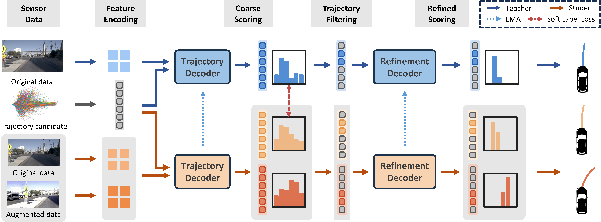

<div id="top" align="center">

<p align="center">
  <h2 align="left">DriveSuprim: Towards Precise Trajectory Selection for End-to-End Planning</h1>
</p>

</div>

<!-- TODO: check main page -->

<br/>

> [**DriveSuprim: Towards Precise Trajectory Selection for End-to-End Planning**](https://arxiv.org/abs/2506.06659)
>
> [Wenhao Yao](https://william-yao-2000.github.io/)<sup>1,2</sup>, [Zhenxin Li](https://woxihuanjiangguo.github.io/)<sup>1,2</sup>, [Shiyi Lan](https://voidrank.github.io/)<sup>3</sup>, [Zi Wang](https://scholar.google.com/citations?user=0SuL2yUAAAAJ&hl=en)<sup>3</sup>, [Xinglong Sun](https://www.xinglongsun.com/)<sup>3</sup>, [Jose M. Alvarez](https://alvarezlopezjosem.github.io/)<sup>3</sup>, [Zuxuan Wu](https://zxwu.azurewebsites.net/)<sup>1,2*</sup>  <br>
>
> <sup>1</sup>Shanghai Key Lab of Intell. Info. Processing, School of CS, Fudan University \
> <sup>2</sup>Shanghai Collaborative Innovation Center of Intelligent Visual Computing \
> <sup>3</sup>NVIDIA
>
> Proceedings of the AAAI Conference on Artificial Intelligence (AAAI), 2026
<br/>

## Architecture

<p align="center">
  
</p>


## Getting started <a name="gettingstarted"></a>

- [Download and Installation](docs/install.md)
- [Dataset Splits](docs/splits.md)
- [Trajectory Score Generation](docs/score_generation.md)
- [Augmented Data Generation](docs/augmentation.md)
- [Training and Evaluation](docs/train_eval.md)

## Model Checkpoints

|Model|Resolution|Backbone | EPDMS | Checkpoint |
|:-|:-:|:---:|:----:|:----:|
|[DriveSuprim_R34](navsim/planning/script/config/common/agent/drivesuprim_agent_r34.yaml) | 512x2048 | ResNet34 | 83.1 | [link](https://huggingface.co/alkaid-2000/DriveSuprim/resolve/main/model_ckpt/drivesuprim_r34.ckpt) |
|[DriveSuprim_V2-99](navsim/planning/script/config/common/agent/drivesuprim_agent_vov.yaml) | 512x2048 | [V2-99](https://huggingface.co/alkaid-2000/DriveSuprim/resolve/main/pretrained_backbones/dd3d_det_final.pth) | 86.0 | [link](https://huggingface.co/alkaid-2000/DriveSuprim/resolve/main/model_ckpt/drivesuprim_vov.ckpt) |
|[DriveSuprim_ViT-L](navsim/planning/script/config/common/agent/drivesuprim_agent_vit.yaml) | 256x1024 | [ViT-Large](https://huggingface.co/alkaid-2000/DriveSuprim/resolve/main/pretrained_backbones/da_vitl16.pth) | 87.1 | [link](https://huggingface.co/alkaid-2000/DriveSuprim/resolve/main/model_ckpt/drivesuprim_vit.ckpt) |


## License and citation <a name="licenseandcitation"></a>

All assets and code in this repository are under the [Apache 2.0 license](./LICENSE) unless specified otherwise. Please consider citing our paper and project if they help your research.

```BibTeX
@article{yao2025drivesuprim,
  title={DriveSuprim: Towards Precise Trajectory Selection for End-to-End Planning},
  author={Wenhao Yao and Zhenxin Li and Shiyi Lan and Zi Wang and Xinglong Sun and Jose M. Alvarez and Zuxuan Wu},
  journal={arXiv preprint arXiv:2506.06659},
  year={2025}
}
```


## Acknowledgement <a name="acknowledgement"></a>

Many thanks to the following excellent open-source projects:

- [NAVSIM](https://github.com/autonomousvision/navsim)
- [TransFuser](https://github.com/autonomousvision/transfuser)
- [GTRS](https://github.com/NVlabs/GTRS)
